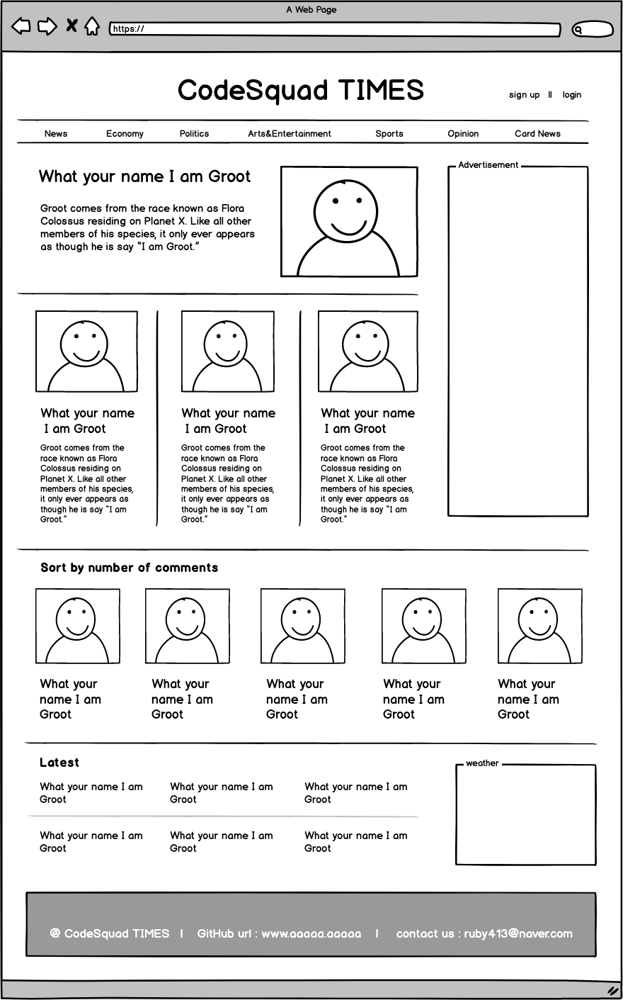
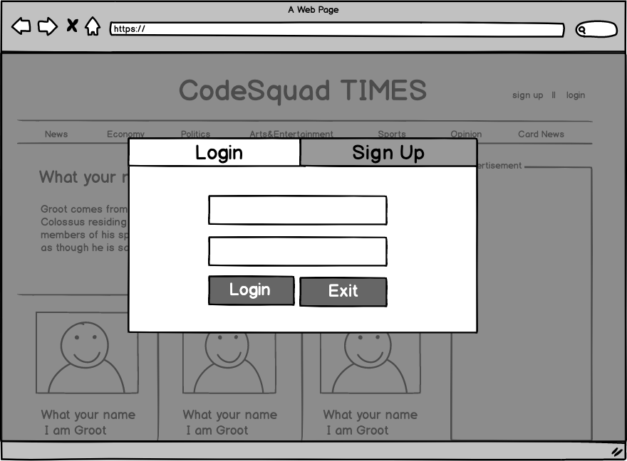
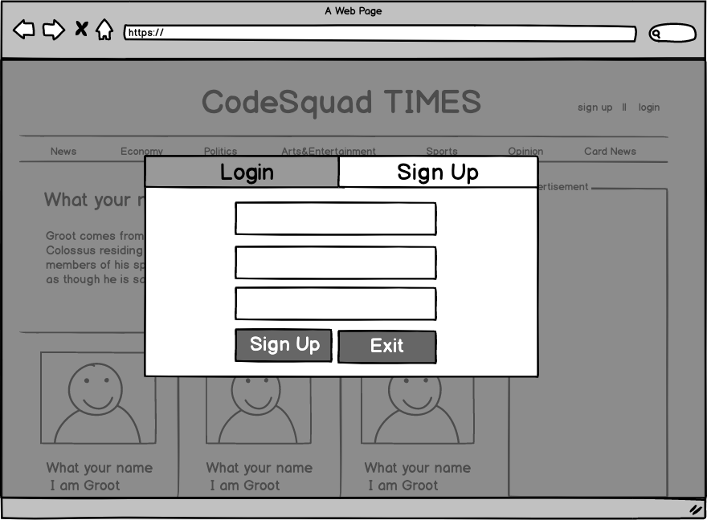
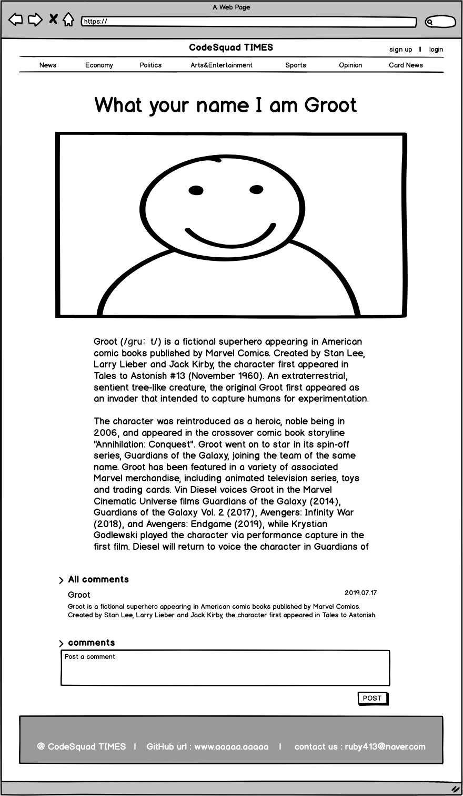
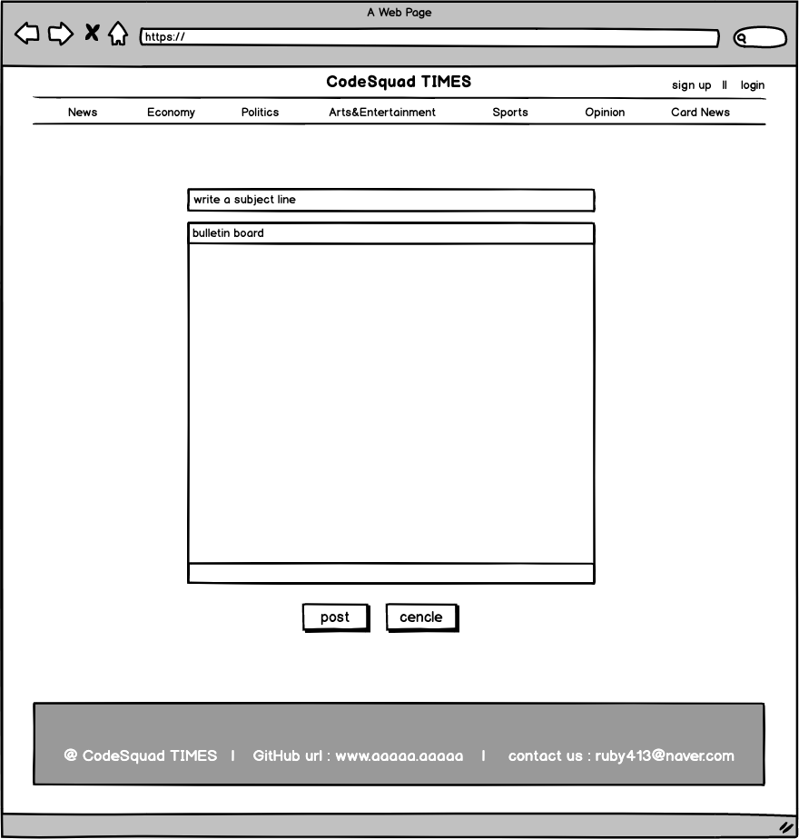

# Node.js news site
> 분야별로 기사를 확인할 수 있는 뉴스 페이지 입니다.

 

## :desktop_computer: 화면구조 
:page_facing_up:  main page
- 조회 수가 높은 순으로 상단에 보여집니다.
- 댓글이 많은 순으로 보여지는 section 과 최근 업로드 된 순으로 보여지는 section이 있습니다.
- 각각의 카테고리를 클릭했을 때, main page와 동일힌 구조로 보여집니다.

 

:page_facing_up: 회원가입 / 로그인 페이지
- 회원가입은 이름, 이메일주소, 비밀번호로 구성되어 있습니다.
- 로그인은 등록된 이메일주소, 비밀번호로 들어갈 수 있습니다.

 

:page_facing_up: News Page
- 기사 제목, 기사 내용, 모든 댓글, 댓글 달기 공간으로 나뉘어져 있습니다.
- 댓글에는 좋아요 기능이 추가되어 있습니다.

 

:page_facing_up: POST 페이지
- 제목과 게시물을 작성해서 post 할 수 있습니다.
- 이미지를 첨부해서 올릴 수 있습니다.

  

## :desktop_computer: 권한 및 기능
:bust_in_silhouette: USER
- 로그인, 회원가입, 로그아웃
- 기사 확인
- 본인의 댓글 작성, 수정, 삭제 가능
- 댓글 좋아요 클릭

 

:woman_technologist: REPORTER
- 본인 기사 작성, 수정, 삭제 가능

 

:prince: ADMIN
- 권한 부여

  

## :desktop_computer: API
:bust_in_silhouette: USER
- Main Page : GET / 
- 로그인 화면 : GET /login
- 로그인 : POST /login
- 회원가입 화면 : GET /signUp
- 회원가입 : POST /signUp
- 로그아웃 : POST /logout

 

:woman_technologist: REPORTER
- 기사 페이지 : GET /post
- 기사 추가 : POST /post
- 기사 삭제 : DELETE /post
- 기사 수정 : PATCH /post

 

:email: comment
- 댓글 추가 : POST /comment
- 댓글 삭제 : DELETE /comment
- 댓글 수정 : PATCH /comment

 

:prince: ADMIN
- 권한 부여 : POST /privilege

  

## :desktop_computer: DataBase
:bust_in_silhouette: USER

| Key       | Value           |
| --------- | --------------- |
| name      | 사용자 이름   |
| Id        | 사용자 아이디   |
| password  | 사용자 비밀번호 |
| privilege | 사용자 권한     |

 

:woman_technologist: : REPORT

| Key            | Value           |
| -------------- | --------------- |
| reporter       | 작성자   |
| subject        | 기사 제목   |
| category       | 카테고리   |
| reportDate     | 기사 등록시간   |
| views          | 기사 조회 수   |
| constents      | 기사내용  |
| comments       | 댓글    |
| comments Date  | 댓글 등록시간 |
| comments Good  | 댓글 좋아요 수 |

  

## :desktop_computer: 추후 확장
:massage_woman: Admin DashBoard 화면
